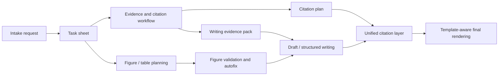

[English](./README.md) | [简体中文](./README.zh-CN.md)

# paper-intake-router


> 🧭 *OpenClaw-first workflow core for turning paper requests into structured, evidence-aware, figure-aware, citation-consistent deliverables.*

`paper-intake-router` is an **OpenClaw-oriented paper workflow Skill / engine**.

It is built for academic work where text generation alone is not enough — the agent also needs workflow structure, source discipline, figure/table planning, and stable citation handling.

## 📚 Contents

- [Why this project exists](#-why-this-project-exists)
- [What it does](#-what-it-does)
- [OpenClaw-first compatibility](#-openclaw-first-compatibility)
- [Workflow at a glance](#-workflow-at-a-glance)
- [Repository layout](#-repository-layout)
- [Installation](#-installation)
- [API keys and external services](#-api-keys-and-external-services)
- [Quick start](#-quick-start)
- [More detailed usage](#-more-detailed-usage)
- [Typical artifacts](#-typical-artifacts)
- [Examples and validation](#-examples-and-validation)
- [What this project is](#-what-this-project-is)
- [What this project is not](#-what-this-project-is-not)
- [License](#license)


## ✨ Why this project exists

Most AI writing tools can generate paragraphs.

Much fewer can reliably handle the operational side of academic writing:

- normalize paper requests into structured tasks
- separate primary materials from weak secondary inputs
- build evidence and citation layers before drafting
- plan figures and tables before the paper is already written
- keep figure references, numbering, and final citations consistent
- adapt the final output to a chosen template / citation rendering profile

*This project focuses on that missing layer.*

## 🔧 What it does

### Intake and task routing
- normalize requests into structured task sheets
- infer defaults for paper type, language, style, and delivery mode
- resolve default layout templates when no official template is provided

### Evidence and citation workflow
- reference shortlist
- screening and retry search flow
- reference pack
- writing evidence pack
- citation plan by chapter and claim type

### Figure / table workflow
- figure-table planning before drafting
- numbering rules derived from template logic
- code / CSV / artifact scaffolding
- validation of figure references against the plan
- autofix for figure explanation prose and citation modes

### Unified citation layer
- supports both normal prose and figure explanation sentences
- supports `support-note`, `inline-marker`, and `internal-anchor`
- renders final citations into GB/T 7714 or APA-style output
- supports template-aware citation rendering profiles

## 🧩 OpenClaw-first compatibility

This repository is built first for the **OpenClaw** ecosystem.

It may still be reusable in other agent / CLI environments such as **Claude Code**, **OpenCode**, or similar coding-agent runtimes, but it is **not guaranteed to work out of the box** there.

If you are using another environment, expect to adapt:

- runtime assumptions
- workspace/path conventions
- upstream search and evidence backends
- tool wiring and invocation glue

## 🗺 Workflow at a glance



## 🗂 Repository layout

```text
paper-intake-router/
├── SKILL.md
├── scripts/
├── references/
├── paper-template-library/
├── examples/
├── README.md
├── README.zh-CN.md
└── LICENSE
```

## 🚀 Installation

### Linux / macOS / WSL

```bash
git clone https://github.com/NanAquarius/paper-intake-router.git
cd paper-intake-router
chmod +x scripts/install.sh
./scripts/install.sh
source .venv/bin/activate
```

### Windows PowerShell

```powershell
git clone https://github.com/NanAquarius/paper-intake-router.git
cd paper-intake-router
powershell -ExecutionPolicy Bypass -File .\scripts\install.ps1
.\.venv\Scripts\Activate.ps1
```

### Manual setup

```bash
python3 -m venv .venv
source .venv/bin/activate
pip install -r requirements-minimal.txt
```

## 🔑 API keys and external services

The **local core workflow** does **not** require API keys for:

- task sheet generation
- figure/table planning
- local validation and autofix
- citation rendering
- smoke tests

However, full literature-search and evidence-building workflows often benefit from or depend on external providers.

Typical examples:

- Semantic Scholar API
  - official overview: <https://www.semanticscholar.org/product/api>
  - tutorial: <https://www.semanticscholar.org/product/api/tutorial>
  - API docs: <https://api.semanticscholar.org/api-docs/>
- OpenAlex
- Tavily / Exa / other search providers

*Recommendation:* document clearly in your own deployment which upstream providers are required and which steps depend on them.

## ⚡ Quick start

### 1. Build a task sheet

```bash
python3 scripts/build_task_sheet.py \
  --input examples/intake.json \
  --out-json /tmp/task.json
```

### 2. Build a figure/table plan

```bash
python3 scripts/build_figure_table_plan.py \
  --task /tmp/task.json \
  --out-json /tmp/figure-plan.json
```

### 3. Convert figure text into internal anchors

```bash
python3 scripts/autofix_figure_table_refs.py \
  --plan /tmp/figure-plan.json \
  --draft examples/draft.md \
  --citation-mode internal-anchor \
  --out /tmp/fixed.md
```

### 4. Render final citations

```bash
python3 scripts/render_final_citations.py \
  --draft /tmp/fixed.md \
  --reference-pack examples/reference-pack.json \
  --style 'GB/T 7714' \
  --out /tmp/final.md
```

## 🛠 More detailed usage

### Build a normalized task sheet

```bash
python3 scripts/build_task_sheet.py \
  --input examples/intake.json \
  --out-json /tmp/task.json \
  --out-md /tmp/task.md
```

### Build a figure/table plan

```bash
python3 scripts/build_figure_table_plan.py \
  --task /tmp/task.json \
  --out-json /tmp/figure-plan.json \
  --out-md /tmp/figure-plan.md
```

Optional inputs:

- `--evidence-pack`
- `--citation-plan`

### Generate figure/table code scaffolding

```bash
python3 scripts/generate_figure_table_codegen.py \
  --plan /tmp/figure-plan.json \
  --base-dir /tmp/paper-artifacts
```

### Validate figure/table references

```bash
python3 scripts/validate_figure_table_refs.py \
  --plan /tmp/figure-plan.json \
  --draft /tmp/draft.md \
  --out-json /tmp/figure-validation.json \
  --out-md /tmp/figure-validation.md
```

### Render final citations with a profile

```bash
python3 scripts/render_final_citations.py \
  --draft /tmp/fixed.md \
  --reference-pack examples/reference-pack.json \
  --citation-profile-json /tmp/profile.json \
  --style 'APA' \
  --out /tmp/final.md
```

## 📦 Typical artifacts

Depending on the path you run, the workflow may produce:

- `task.json` / `task.md`
- `references-shortlist.json` / `.md`
- `reference-screening.json` / `.md`
- `reference-pack.json` / `.md`
- `writing-evidence-pack.json` / `.md`
- `citation-plan.json` / `.md`
- `figure-table-plan.json` / `.md`
- code / CSV / figure / table artifacts
- fixed drafts
- final rendered drafts

## 🧪 Examples and validation

Included examples:

- `examples/intake.json`
- `examples/draft.md`
- `examples/reference-pack.json`
- `examples/layout-samples/README.md`

Minimal validation entrypoint:

- `scripts/smoke_test_pipeline.py`

## ✅ What this project is

This project is best thought of as a:

- **paper workflow engine**
- **formatting and citation stabilizer**
- **draft-to-deliverable orchestration layer for agents**

## 🚫 What this project is not

It does **not** guarantee:

- school-specific compliance without the real official template
- real experimental validity
- submission-readiness without human review
- invention of trustworthy data, results, or references
- bundled redistributable thesis / journal / conference PDF samples by default

See `references/capability-boundaries.md` for the current operational boundaries.

---

⭐ *If this project helps, consider starring the repo.*

🤝 *Issues and contributions are welcome.*

## License

MIT
